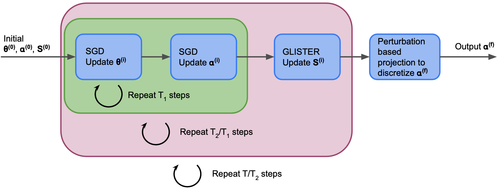

<br/>
<p align="center"></p>

----


Adapative-DPT is the first NAS algorithm to make use of adaptive subset selection. We uncover a natural connection between one-shot NAS algorithms and adaptive subset selection and devise an algorithm that makes use of state-of-the-art techniques from both areas. We use these techniques to substantially reduce the runtime of DARTS-PT (a leading one-shot NAS algorithm), as well as BOHB and DEHB (leading multifidelity optimization algorithms), by up to 8x, without sacrificing accuracy. We also add facility location as a novel baseline for subset selection applied to NAS.[Paper](https://openreview.net/attachment?id=hRqiQ2i5ps&name=pdf) 


<p align="center"></p>

Overview
------------

This codebase extends the excellent public repository [DARTS-PT](https://github.com/ruocwang/darts-pt). 
The codebase consists of three different approaches to subset selection for NAS (using DARTS-PT).

1. Facility Location - we have used submodlib library's facility loaction function implemenatation. You can read more about facility location [here](https://submodlib.readthedocs.io/en/latest/functions/facilityLocation.html).

2. Proxy data - this implementation is based on [prior work](https://arxiv.org/abs/2106.04784). We have extended their [code](https://github.com/nabk89/NAS-with-Proxy-data) to DARTS-PT. The supernetwork is trained and discretized using a subset of the training data, selected using a combination of high and low-entropy datapoints.

3. Adaptive-DPT - Adaptive subset selection using [GLISTER](https://arxiv.org/abs/2012.10630).

Preparing the environment
--------------------------
We used the same setup as in DARTS-PT:

```
Python >= 3.7
PyTorch >= 1.5
tensorboard == 2.0.1
gpustat
```

1. Download [NAS-Bench-201-v1_0-e61699.pth](https://drive.google.com/file/d/1SKW0Cu0u8-gb18zDpaAGi0f74UdXeGKs/view) and save it under `./data`.

2. Install nas-bench-201. (Note: to be consistent with darts-pt, use the `[2020-02-25]` version of the NAS-Bench-201 API).
```bash
pip install nas-bench-201
```


Running experiments
--------------------

Now, we describe how to reproduce all tables and figures in our paper.

For NAS-Bench-201 results, the checkpoints and logs will be saved to `./experiments/nasbench201/search-{script_name}-{seed}/.` For example, the checkpoint dir would be `./experiments/nasbench201/search-darts-201-1/`.

For S4 and S5, the checkpoints and logs will be saved to `./experiments/sota/{dataset}/search-{script_name}-{space_id}-{seed}/.` For example, `./experiments/sota/cifar10/search-darts-sota-s4-1/`.


### Adaptive DPT 

```bash
cd SubsetSelection_NAS/our_work/darts-pt/exp_scripts
```

1.1 cifar 10 dataset (Table 1)

```bash
bash run_proxy_seeds.sh
```
Run the above commands for seeds 0, 10, 20, 30, 40.

1.2 cifar-100 dataset (Table 2)

Change dataset argument inside `darts-201.sh` and `darts-proj-201.sh` to `cifar-100`

```bash
bash run_proxy_seeds.sh
```
Run the above commands for seeds 0, 10, 20, 30, 40.


1.3 Imagenet dataset (Table 3)

Change dataset argument inside `darts-201.sh` and `darts-proj-201.sh` to `imagenet16-120`

```bash
bash run_proxy_seeds.sh
```
Run the above commands for seeds 0, 10, 20, 30, 40.


1.4 S4 with cifar 10 dataset (Table 4)

Supernet Training:
```bash
bash darts-sota.sh --space s4 --dataset cifar10
```
Architecture Selection:
```bash
bash darts-proj-sota.sh --space s4 --dataset s4 --resume_expid search-darts-sota-s4-2
```

1.5 DARTS search space with cifar10 dataset (Table 5)

Supernet Training:
```bash
bash darts-sota.sh
```
Architecture Selection:
```bash
bash darts-proj-sota.sh --resume_expid search-darts-sota-s5-2
```

### DARTS-PT-ENTROPY

```bash
cd SubsetSelection_NAS/modifications/dartspt_plus_proxy_data/darts-pt/exp_scripts
```

2.1 cifar 10 dataset (Table 1)

```bash
bash darts-201.sh
```

2.2 cifar-100 dataset (Table 2)

Change dataset argument inside `darts-201.sh` and `darts-proj-201.sh` to `cifar-100`
```bash
bash darts-201.sh
```


2.3 Imagenet dataset (Table 3)

Change dataset argument inside `darts-201.sh` and `darts-proj-201.sh` to `imagenet16-120`
```bash
bash darts-201.sh
```


2.4 S4 with cifar 10 dataset (Table 4)

Supernet Training:
```bash
bash darts-sota.sh --space s4 --dataset cifar10
```
Architecture Selection:
```bash
bash darts-proj-sota.sh --space s4 --dataset s4 --resume_expid search-darts-sota-s4-2
```

2.5 DARTS search space with cifar10 dataset (Table 5)

Supernet Training:
```bash
bash darts-sota.sh
```
Architecture Selection:
```bash
bash darts-proj-sota.sh --resume_expid search-darts-sota-s5-2
```

### DARTS-PT-RAND

```bash
cd SubsetSelection_NAS/modifications/dartspt_plus_proxy_data/darts-pt/exp_scripts
```

Remove --histogram and --histogram_type from darts-201.sh

3.1 cifar 10 dataset (Table 1)

```bash
bash darts-201.sh
```

3.2 cifar-100 dataset (Table 2)

Change dataset argument inside `darts-201.sh` and `darts-proj-201.sh` to `cifar-100`
```bash
bash darts-201.sh
```

3.3 Imagenet dataset (Table 3)

Change dataset argument inside `darts-201.sh` and `darts-proj-201.sh` to `imagenet16-120`
```bash
bash darts-201.sh
```


3.4 S4 with cifar 10 dataset (Table 4)

Supernet Training:
```bash
bash darts-sota.sh --space s4 --dataset cifar10
```
Architecture Selection:
```bash
bash darts-proj-sota.sh --space s4 --dataset s4 --resume_expid search-darts-sota-s4-2
```

3.5 DARTS search space with cifar10 dataset (Table 5)

Supernet Training:
```bash
bash darts-sota.sh
```
Architecture Selection
```bash
bash darts-proj-sota.sh --resume_expid search-darts-sota-s5-2
```

### DARTS-PT-FL

```bash
cd SubsetSelection_NAS/our_work/darts-pt-with-fl/exp_scripts
```

4.1 cifar 10 dataset (Table 1)

```bash
bash run_fl_seeds.sh
```
Run the above commands for seeds 0, 10, 20, 30, 40.

4.2 cifar-100 dataset (Table 2)

Change dataset argument inside `darts-201.sh` and `darts-proj-201.sh` to `cifar-100`

```bash
Run bash run_fl_seeds.sh
```

Run the above commands for seeds 0, 10, 20, 30, 40.

4.3 Imagenet dataset (Table 3)

Change dataset argument inside `darts-201.sh` and `darts-proj-201.sh` to `imagenet16-120`

```bash
Run bash run_fl_seeds.sh
```

Run the above commands for seeds 0, 10, 20, 30, 40.


4.4 S4 with cifar 10 dataset (Table 4)

Supernet Training:
```bash
bash darts-sota.sh --space s4 --dataset cifar10
```
Architecture Selection:
```bash
bash darts-proj-sota.sh --space s4 --dataset s4 --resume_expid search-darts-sota-s4-2
```

4.5 DARTS search space with cifar10 dataset (Table 5)

Supernet Training:
```bash
bash darts-sota.sh
```

Architecture Selection:
```bash
bash darts-proj-sota.sh --resume_expid search-darts-sota-s5-2
```

### DARTS-PT

```bash
cd SubsetSelection_NAS/basecodes/darts-pt/exp_scripts
```
5.1 Please refer to the instructions in [ruocwang/darts-pt](https://github.com/ruocwang/darts-pt).


### Ablations

6.1 Table 7

```bash
cd SubsetSelection_NAS/our_work/darts-pt
```

For the cifar 10 dataset,

Change --sampling_portion to 0.1, 0.2, 0.3, 0.4, 0.5
```bash
bash run_proxy_seeds.sh 
```
Run the above commands for seeds 0, 10, 20, 30, 40.

6.2 Table 8

```bash
cd SubsetSelection_NAS/our_work/darts-pt
```

For the cifar 10 dataset,

Change --sampling_portion to 0.1, 0.2, 0.3, 0.4, 0.5 (Dont change it for projection code, i.e., change num_train = len(train_data) * args.sampling_portion to num_train = len(train_data) inside '#### architecture selection / projection' of train_search_glister.py file inside nasbench201 directory)

```bash
bash run_proxy_seeds.sh
```
Run the above commands for seeds 0, 10, 20, 30, 40.


6.3 Table 9

Same as 1., 1.3 but,
Change num_train = len(train_data) * args.sampling_portion to num_train = len(train_data) inside '#### architecture selection / projection' of train_search_glister.py file inside nasbench201 directory

6.4 Table 6

Same as 7. and 8. but,
Change num_train = len(train_data) * args.sampling_portion to num_train = len(train_data) inside '#### architecture selection / projection' of train_search_glister.py file inside nasbench201 directory

### Figure 2

We plotted from the results of Table 7. (i.e 6.1) and Table8. (i.e 6.2)

### BOHB

```bash
cd HpBandSter/hpbandster/examples/
python example_5_mnist.py
```

### Adaptive BOHB 

```bash
cd HpBandSter_cords/hpbandster/examples/
python example_5_mnist.py
```

(To run for different sampling portions, change the 'fraction' value inside compute function.)

### DEHB

```bash
cd DEHB/examples/03_pytorch_mnist_hpo.py
python 03_pytorch_mnist_hpo.py
```

### Adaptive DEHB

```bash
cd AdaptiveNAS_DEHB/DEHB/examples/
python 03_pytorch_mnist_hpo2.py
```

 (To run for different sampling portions, change the 'fraction' value inside compute function.)


Results of Adaptive-DPT
-------------------------

|Dataset        | Search Space  |        Accuracy           | GPU hours | Subset size |
|:-------------:|:-------------:|:-------------------------:|:---------:|:-----------:|
|Cifar-10       | Nas-Bench-201 |    92.22 ± 1.76           | 0.83      |    10       |
|Cifar-100      | Nas-Bench-201 |    64.27 ± 3.37           | 0.87      |    10       |
|Imagenet16-120 | Nas-Bench-201 |    36.10 ± 6.96           | 2.60      |    10       |
|Cifar-10       |      S4       |    97.30 ± 0.12           | 1.08      |    10       |
|Cifar-10       |     DARTS     |    97.30 ± 0.05           | 8.82      |    30       |
